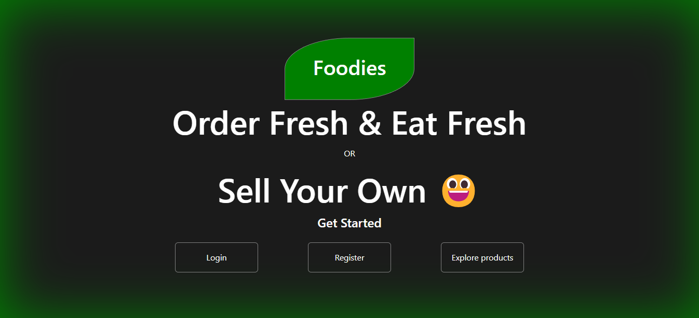

# Foodies
A simple food ordering web application where one can be registered as reatiler to sell his/her own product or can be registered as consumer where he/she can order.

  

## Technologies Used: 
<ul> 
    <li> 
        <ul> 
            FrontEnd: 
            <li> EJS </li>
            <li> CSS </li>
            <li> JavaScript </li>
            <li> BootStrap </li>
        </ul>
    </li>
    <li> 
        <ul> 
            Backend: 
            <li> NodeJS </li>
            <li> ExpressJS </li>
            <li> Database: MongoDB </li>
        </ul>
    </li>
</ul>

## Modules/Features
<ul> 
    <li> 
        <ul> UnAuthenticated User
            <li> Register </li>
            <li> View All Products </li>
            <li> View Particular Product </li>
            <li> Search </li>
        </ul>
    </li>
    <li> 
        <ul> Authenticated User (As Consumer)
            <li> All Functions of UnAuthenticated User </li>
            <li> Add to Cart </li>
            <li> Delete from Cart </li>
            <li> View Cart </li>
            <li> Search </li>
            <li> Order/Make Payment </li>
            <li> Logout </li>
        </ul>
    </li>
    <li> 
        <ul> UnAuthenticated User (As Retailer)
            <li> All Functions of Authenticated User </li>
            <li> Add New Product </li>
            <li> Edit/Update Product </li>
            <li> Delete Product </li>
        </ul>
    </li>
</ul>

## How to run
-> clone this repository to local storage *(git clone https://github.com/djgupta820/foodies.git)*  
-> change directory to cloned directory *(cd foodies)*  
-> fire the command *nodemon index.js*  
-> this project will run on *http://192.168.0.14:5000*  
-> if you want to change the address to localhost *change ip variable in index.js file to localhost or 127.0.0.1*  
-> ctrl + click on the link displayed on console or go to *192.168.0.14:5000* on browser  
-> Done &#128515;  